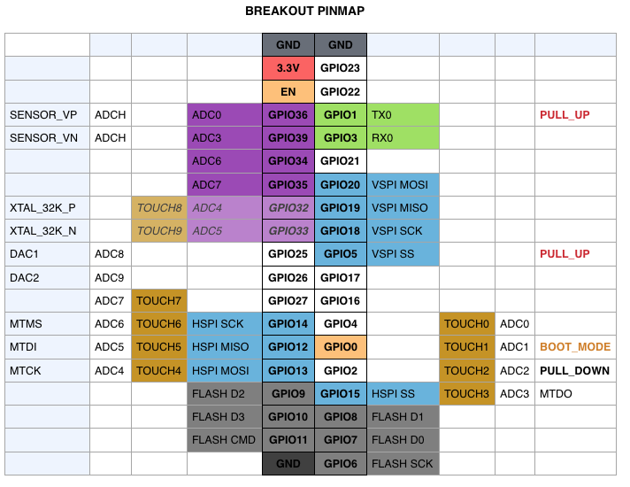

##Arduino core for ESP31B WiFi chip##
===========================================
###This is a beta project for a beta chip. Do not take it as final or stable. Intention is to have a working environment to test the new hardware and prepare the core and peripheral libs for the upcoming final ESP32 release.###

###This project brings support for ESP31B chip to the Arduino environment. It lets you write sketches using familiar Arduino functions and libraries, and run them directly on ESP31B, no external microcontroller required.###

- Compile the toolchain for your platform [Instructions](https://github.com/espressif/ESP32_RTOS_SDK#toolchain) or download one of the toolchains below:
  * [Mac OS X](http://static.ficeto.com/xtensa-esp108-elf-osx.tar.gz)
  * [Linux 32](http://static.ficeto.com/xtensa-esp108-elf-linux32.tar.gz)
  * [Linux 64](http://static.ficeto.com/xtensa-esp108-elf-linux64.tar.gz)
  * [RaspberryPi 2](http://static.ficeto.com/xtensa-esp108-elf-pi2.tar.gz)
  * [Windows 32](http://static.ficeto.com/xtensa-esp108-elf-cygwin32.zip) !! Requires [Cygwin x86](https://cygwin.com/setup-x86.exe) to be installed (defaults are enough) and C:\cygwin\bin to be added to Path
  * [Windows 64](http://static.ficeto.com/xtensa-esp108-elf-cygwin64.zip) !! Requires [Cygwin x86_64](https://cygwin.com/setup-x86_64.exe) to be installed (defaults are enough) and C:\cygwin64\bin to be added to Path
- Install Arduino 1.6.5+
- Go to Arduino directory
- Clone this repository into hardware/espressif/ESP31B directory (or clone it elsewhere and create a symlink)
```bash
cd hardware
mkdir espressif
cd espressif
git clone https://github.com/me-no-dev/ESP31B.git
```
- Install Python 2.7 and have it included in the PATH
- Extract/Copy the toolchain into hardware/espressif/ESP31B/tools directory
- Restart Arduino

#### Also Compatible with the Arduino Eclipse plugin ####


#### Notes on compatibility ####

The following hardware should be working:
- HSPI and VSPI SPI busses attached to any pin (VSPI is the devault SPI bus)
- UART 0 and 1 (0 is attached to pins 1 and 3) UART 1 can be attached to any pins
- pinMode/digitalRead/digitalWrite/attachInterrupt
- analogRead (duh) SDK functions are exposed (same goes for touch pads)
- 4 types of PWM! SigmaDelta, LEDC_HF, LEDC_LF and the old style based on timer (currently the one attached to analogWrite)
- ccompare and 1 hardware timers with Interrupts
- pinMatrix functions for easy signal routing (those are mostly the same as the ones in the driver lib)

Mostly everything should work the same as on ESP8266. Some methods are removed from the ESP and WiFi classes as they are not available anymore.
UDP Multicasts are not build into lwip yet so any service that depends on them would not work (mDNS, SSDP and such).
ArduinoOTA is also not working yet as it requires different rom layout.

Included inside is my Async TCP and Web server as well (regular blocking server and client are there also) for those that want to run full speed and handle more than one client at a time.

- The noted pins for HSPI and VSPI are the default ones and can be changed with SPI.begin(sck, miso, mosi, ss) (ss can be defined with -1)
- Pins 32 and 33 have been routed differently on the module and you need to have some high soldering skills to put a couple of resistors to make the pins work
- Pins 6-11 are used by the onboard flash module (which I ws able to run only as 2MB)
- Pins 1,2 and 5 can be floating, but if connected to external hardware, the noted levels need to be active at boot for the chip to enter proper boot mode
- Only the first 8 pin interrupts/counters are implemnted but it's at the top of my ToDo list to enable all 16
- LedC PWM, SigmeDelta and Touch need to be wrapped in classes




### License and credits ###

Most of the original source comes from the [ESP8266 Arduino Project](https://github.com/esp8266/Arduino) so hats off to @igrr, @Links2004, @me(no-dev) and many others

Arduino IDE is developed and maintained by the Arduino team. The IDE is licensed under GPL.

Espressif SDK included in this build is under Espressif MIT License.

ESP31B core files are licensed under LGPL.

[SPI Flash File System (SPIFFS)](https://github.com/pellepl/spiffs) written by Peter Andersson is used in this project. It is distributed under MIT license.
